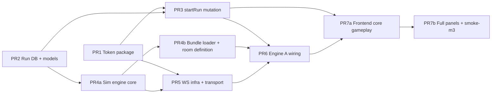

# M3 Engine A Vertical Slice — Plan

Status: Planning only. No implementation in this document.

Binding inputs used:
- `docs/AGENTS/m3-research.md` (approved; decisions are binding)
- `docs/ARCHITECTURE.md`
- `docs/DECISIONS.md`
- Existing code under `internal/`, `cmd/`, `web/src/`
- Playbook §8.2 template from `/Users/siddharthsharma/Downloads/Systems_Escape_Rooms_Agentic_Development_Playbook_v0_7.docx`

Global execution guardrails:
- Follow AGENTS stop conditions (max 2 CI retry cycles, stop on flaky tests, stop on scope escape).
- Tests-first per PR (red -> green).
- `make ci` before declaring each PR done.
- Respect module boundaries from `AGENTS.md` and `docs/ARCHITECTURE.md`.

---

## 1) PR-by-PR Breakdown (9 PRs)

Note: This intentionally expands the original 8-PR research split by dividing PR4 into PR4a/PR4b to honor 400-LOC diff guardrails.

## PR1 — Token Package

Goal: Add shared runToken mint/verify package (HS256) for BFF minting and Engine A verification.

Dependencies: None  
Estimated LOC: ~250

Files to create:
- `internal/token/claims.go`
- `internal/token/mint.go`
- `internal/token/verify.go`
- `internal/token/token_test.go`

Files to modify:
- `go.mod`
- `go.sum`

Red-green test plan:
1. Red: Add table-driven tests for mint+verify roundtrip, expired token rejection, wrong engine rejection, wrong runId rejection, malformed token rejection.
2. Red: Assert claim fields (`sub`, `runId`, `engine`, `iat`, `exp`) and TTL handling.
3. Green: Implement minimal mint/verify code to satisfy tests.
4. Gate: `go test ./internal/token -count=1`, then `make test-unit`, then `make ci`.

Scope fence:
- Allowed paths:
  - `internal/token/**`
  - `go.mod`
  - `go.sum`
- Forbidden paths:
  - `migrations/**`
  - `internal/graphql/**`
  - `internal/engine/**`
  - `cmd/**`
  - `web/**`
  - `rooms/**`
  - `Makefile`

Acceptance criteria:
- Token package can mint and verify runTokens with HS256.
- Claims enforce `runId` + `userId` + `engine` scope and expiration.
- Unit tests cover success + failure cases and pass.

---

## PR2 — Run DB + Models + Repo

Goal: Introduce run persistence (`runs`, `run_actions`), shared run models, and Engine A repo APIs.

Dependencies: None  
Estimated LOC: ~350

Files to create:
- `migrations/0005_runs_actions.up.sql`
- `migrations/0005_runs_actions.down.sql`
- `pkg/models/run.go`
- `internal/engine/a/repo/run_repo.go`
- `internal/engine/a/repo/run_repo_test.go`

Files to modify:
- None expected (unless test helpers require minimal extension).

Red-green test plan:
1. Red: Add repo tests for create run, get run by ID, append action with monotonic seq, list actions ordered by seq, duplicate `client_request_id` dedupe path for player actions.
2. Red: Add repo tests for virtual tick entries (`type=tick`) with no `clientRequestId`.
3. Red: Ensure idempotency uniqueness applies only when `clientRequestId` is present.
4. Red: Run repo tests to confirm failure before migration/repo implementation (missing tables or unimplemented methods).
5. Green: Add migration + models + repo implementation.
6. Gate: `make migrate-up`, `go test -count=1 ./internal/engine/a/repo`, `make test-integration`, then `make ci`.

Scope fence:
- Allowed paths:
  - `migrations/0005_runs_actions.*.sql`
  - `pkg/models/run.go`
  - `internal/engine/a/repo/**`
- Forbidden paths:
  - `internal/token/**`
  - `internal/graphql/**`
  - `internal/engine/a/service/**`
  - `internal/engine/a/transport/**`
  - `cmd/**`
  - `web/**`
  - `Makefile`

Acceptance criteria:
- Migration adds `runs` and `run_actions` with constraints and indexes from research §5.1.
- `run_actions` schema explicitly supports both player and tick entries:
  - `action_type` in (`player`, `tick`)
  - nullable `action_key` / `client_request_id` for ticks
  - partial unique dedup index on `(run_id, client_request_id)` where `client_request_id IS NOT NULL`
- `pkg/models` includes `Run`, `RunStatus`, `RunAction`.
- Repo tests pass against Postgres and cover idempotency+ordering invariants.

---

## PR3 — `startRun` Mutation (BFF)

Goal: Add GraphQL `startRun` in BFF, backed by run creation + token minting.

Dependencies: PR1, PR2  
Estimated LOC: ~400

Files to create:
- `internal/engine/a/service/run_service.go`
- `internal/engine/a/service/run_service_test.go`

Files to modify:
- `internal/graphql/schema.graphql`
- `internal/graphql/generated/generated.go`
- `internal/graphql/generated/models_gen.go`
- `internal/graphql/resolvers/resolver.go`
- `internal/graphql/resolvers/schema.resolvers.go`
- `internal/graphql/resolvers/schema.resolvers_test.go`
- `cmd/graphql-bff/main.go`
- `.env.local` (add `RUN_TOKEN_SECRET`, `RUN_TOKEN_TTL` defaults)

Red-green test plan:
1. Red: Add resolver tests for unauthenticated rejection and authenticated success (`runId` + `runToken` returned).
2. Red: Add service tests for deterministic seed assignment, run row creation, and token mint call.
3. Red: Regenerate gqlgen and run tests to fail on unimplemented resolver path.
4. Green: Implement schema, resolver, service, and wiring.
5. Gate: `make gqlgen`, `go test ./internal/graphql/resolvers ./internal/engine/a/service -count=1`, `make test-unit`, then `make ci`.

Scope fence:
- Allowed paths:
  - `internal/graphql/**`
  - `internal/engine/a/service/run_service*.go`
  - `cmd/graphql-bff/main.go`
  - `.env.local`
- Forbidden paths:
  - `migrations/**`
  - `internal/engine/a/transport/**`
  - `cmd/engine-a/**`
  - `web/**`
  - `Makefile`

Acceptance criteria:
- GraphQL schema exposes `startRun(input: StartRunInput!): StartRunPayload!`.
- Input includes `clientRequestId`; response includes `runId` and `runToken`.
- Resolver requires authenticated user and uses PR2 repo + PR1 token package.
- BFF wiring reads `RUN_TOKEN_SECRET` and `RUN_TOKEN_TTL`.

---

## PR4a — Simulation Engine Core

Goal: Implement deterministic Engine A simulation core (tick loop, action applicator, win checks, replay parity) using fixture data only.

Dependencies: PR2  
Estimated LOC: ~400

Files to create:
- `internal/engine/a/service/types.go`
- `internal/engine/a/service/sim.go`
- `internal/engine/a/service/action.go`
- `internal/engine/a/service/wincheck.go`
- `internal/engine/a/service/replay.go`
- `internal/engine/a/service/sim_test.go`
- `internal/engine/a/service/action_test.go`
- `internal/engine/a/service/wincheck_test.go`
- `internal/engine/a/service/replay_test.go`
- `internal/engine/a/service/testdata/golden_replay.json`

Files to modify:
- None expected.

Red-green test plan:
1. Red: Add deterministic sim tests (same seed + same action sequence -> identical metric timeline).
2. Red: Add action-application tests (seq order, effect override semantics, win-check transitions).
3. Red: Add replay parity tests to prove real-time loop and replay loop converge to identical state.
4. Red: Add virtual tick log-entry tests (`type=tick`, no `clientRequestId`, monotonic seq).
5. Green: Implement minimal sim/replay code to pass tests.
6. Gate: `go test ./internal/engine/a/service -count=1`, `make test-unit`, then `make ci`.

Scope fence:
- Allowed paths:
  - `internal/engine/a/service/**`
- Forbidden paths:
  - `internal/token/**`
  - `internal/graphql/**`
  - `internal/ws/**`
  - `internal/engine/a/transport/**`
  - `internal/roomctl/**`
  - `rooms/**`
  - `pkg/models/**`
  - `internal/engine/a/repo/**`
  - `cmd/**`
  - `web/**`
  - `Makefile`

Acceptance criteria:
- Sim behavior follows binding decision §3.3 (tick model + lerp-to-target + override rules).
- Tick events are recorded in the action log as virtual entries (type: `tick`, no `clientRequestId`).
- Replay reconstructs state by replaying tick + action entries from the log without real-time delays.
- Unit test enforces `replay(action_log) === real_time_result` for the same seed + action sequence.

---

## PR4b — Bundle Loader + Room Definition

Goal: Implement bundle tar extraction/YAML parsing for Engine A and add cache-stampede `simulation.yaml` + roomctl validation cross-checks.

Dependencies: PR4a  
Estimated LOC: ~300

Files to create:
- `internal/engine/a/service/bundle_loader.go`
- `internal/engine/a/service/bundle_loader_test.go`
- `internal/engine/a/service/testdata/cache_stampede_bundle.tar`
- `rooms/cache-stampede/engineA/simulation.yaml`

Files to modify:
- `internal/roomctl/schema.go`
- `internal/roomctl/validate.go`
- `internal/roomctl/validate_test.go`
- `internal/roomctl/build_test.go`

Red-green test plan:
1. Red: Add bundle parser tests for tar+YAML loading, including malformed/missing `simulation.yaml`.
2. Red: Add roomctl tests for required `simulation.yaml` and action-key cross-reference (`actions.yaml` vs `simulation.yaml`).
3. Green: Implement loader and roomctl validation updates.
4. Gate: `go test ./internal/engine/a/service ./internal/roomctl -count=1`, `make roomctl-validate ROOM=cache-stampede`, `make test-unit`, then `make ci`.

Scope fence:
- Allowed paths:
  - `internal/engine/a/service/bundle_loader.go`
  - `internal/engine/a/service/bundle_loader_test.go`
  - `internal/engine/a/service/testdata/cache_stampede_bundle.tar`
  - `rooms/cache-stampede/engineA/simulation.yaml`
  - `internal/roomctl/schema.go`
  - `internal/roomctl/validate.go`
  - `internal/roomctl/validate_test.go`
  - `internal/roomctl/build_test.go`
- Forbidden paths:
  - `internal/token/**`
  - `internal/graphql/**`
  - `internal/ws/**`
  - `internal/engine/a/transport/**`
  - `cmd/**`
  - `web/**`
  - `Makefile`

Acceptance criteria:
- Bundle loader can parse all required Engine A files from tar archives, including `simulation.yaml`.
- `rooms/cache-stampede/engineA/simulation.yaml` is added and valid.
- roomctl validation fails on missing/invalid `simulation.yaml` and on action-key mismatches.

---

## PR5 — WS Infrastructure + Engine A Transport

Goal: Add shared WS envelope/heartbeat/resume logic and Engine A WS handler.

Dependencies: PR1, PR4a  
Estimated LOC: ~500

Files to create:
- `internal/ws/protocol.go`
- `internal/ws/heartbeat.go`
- `internal/ws/resume_buffer.go`
- `internal/ws/protocol_test.go`
- `internal/ws/heartbeat_test.go`
- `internal/ws/resume_buffer_test.go`
- `internal/engine/a/transport/ws_handler.go`
- `internal/engine/a/transport/ws_handler_test.go`

Files to modify:
- `go.mod` (promote `github.com/gorilla/websocket` to direct dep)
- `go.sum`
- `internal/engine/a/service/sim.go` (interface hooks only, if needed)

Red-green test plan:
1. Red: Protocol tests for required envelope fields and type validation.
2. Red: Heartbeat tests for ping interval (25s) and timeout behavior (75s).
3. Red: Resume buffer tests for replay path vs snapshot fallback.
4. Red: WS transport tests for hello auth, `apply_action`, seq monotonicity, one-active-connection-per-run behavior.
5. Green: Implement internal/ws package and transport handler.
6. Gate: `go test ./internal/ws ./internal/engine/a/transport -count=1`, `make test-unit`, then `make ci`.

Scope fence:
- Allowed paths:
  - `internal/ws/**`
  - `internal/engine/a/transport/**`
  - `internal/engine/a/service/sim.go` (interface surface only)
  - `go.mod`
  - `go.sum`
- Forbidden paths:
  - `migrations/**`
  - `internal/graphql/**`
  - `cmd/**`
  - `web/**`
  - `rooms/**`
  - `Makefile`

Acceptance criteria:
- WS protocol matches ARCHITECTURE/ui docs (hello/ack/snapshot/delta/ping/pong/apply_action).
- Resume-by-seq works from ring buffer; stale seq triggers snapshot path.
- Token verification enforced in `hello`.
- Transport tests cover reconnect overlap and idempotent action handling.

---

## PR6 — Engine A Service Wiring (`cmd/engine-a`)

Goal: Turn `cmd/engine-a` from stub into real HTTP+WS service with DB+S3 wiring.

Dependencies: PR3, PR4b, PR5  
Estimated LOC: ~350

Files to create:
- `cmd/engine-a/config.go`
- `cmd/engine-a/config_test.go`
- `internal/engine/a/transport/ws_integration_test.go`

Files to modify:
- `cmd/engine-a/main.go`
- `internal/engine/a/transport/ws_handler.go` (integration hooks only)
- `.env.local` (add `ENGINE_A_PORT=8081` if absent)

Red-green test plan:
1. Red: Add config parsing tests for required env vars/defaults and startup validation errors.
2. Red: Add integration test: connect WS, send hello with valid runToken, send `apply_action`, assert delta/win_update contract.
3. Green: Wire DB pool, run repo, token verifier, bundle store, sim runtime, and WS handler into real server.
4. Green: Add health endpoint and graceful shutdown behavior.
5. Gate: `go test ./cmd/engine-a -count=1`, `go test -run Integration ./internal/engine/a/transport -count=1`, `make test-integration`, then `make ci`.

Scope fence:
- Allowed paths:
  - `cmd/engine-a/**`
  - `internal/engine/a/transport/ws_handler.go`
  - `.env.local`
- Forbidden paths:
  - `migrations/**`
  - `internal/graphql/**`
  - `web/**`
  - `rooms/**`
  - `Makefile` (no new target here)

Acceptance criteria:
- `make run-engine-a` launches a long-running service on `:8081` (no immediate exit).
- `/healthz` returns `200 OK`.
- WS endpoint works end-to-end with runToken verification + snapshot/delta flow.
- Engine A loads room bundle from S3 with in-memory cache.

---

## PR7a — Frontend Core Gameplay

Goal: Deliver core Engine A play loop in web app (WS hook/state + core panels + Start Run flow).

Dependencies: PR3, PR6  
Estimated LOC: ~600

Files to create:
- `web/src/lib/ws/protocol.ts`
- `web/src/lib/ws/client.ts`
- `web/src/lib/ws/heartbeat.ts`
- `web/src/lib/graphql/mutations.ts`
- `web/src/lib/idempotency.ts`
- `web/src/hooks/use-ws.ts`
- `web/src/hooks/use-engine-a.ts`
- `web/src/components/engine-a/MetricsPanel.tsx`
- `web/src/components/engine-a/ActionBar.tsx`
- `web/src/components/engine-a/WinOverlay.tsx`
- `web/src/hooks/__tests__/use-ws.test.ts`
- `web/src/hooks/__tests__/use-engine-a.test.ts`
- `web/src/components/engine-a/__tests__/MetricsPanel.test.tsx`
- `web/src/components/engine-a/__tests__/ActionBar.test.tsx`
- `web/src/components/engine-a/__tests__/WinOverlay.test.tsx`
- `web/src/routes/__tests__/RoomDetailPage.test.tsx`

Files to modify:
- `web/src/routes/EngineAPage.tsx`
- `web/src/routes/RoomDetailPage.tsx`

Red-green test plan:
1. Red: Add RoomDetailPage test verifying Start Run triggers mutation with UUID v4 `clientRequestId`.
2. Red: Add `use-ws` tests for reconnect backoff, ping/pong, and resume seq behavior.
3. Red: Add `use-engine-a` tests for snapshot apply, delta apply, and seq-gap fallback handling.
4. Red: Add panel component tests for rendering + action dispatch wiring.
5. Green: Implement GraphQL mutation client, WS hooks, core panels, and route wiring.
6. Gate: `make ui-lint`, `make ui-test`, `make ui-build`, then `make ci`.

Scope fence:
- Allowed paths:
  - `web/src/lib/ws/**`
  - `web/src/lib/graphql/mutations.ts`
  - `web/src/lib/idempotency.ts`
  - `web/src/hooks/**`
  - `web/src/components/engine-a/MetricsPanel.tsx`
  - `web/src/components/engine-a/ActionBar.tsx`
  - `web/src/components/engine-a/WinOverlay.tsx`
  - `web/src/components/engine-a/__tests__/**`
  - `web/src/routes/EngineAPage.tsx`
  - `web/src/routes/RoomDetailPage.tsx`
  - `web/src/routes/__tests__/RoomDetailPage.test.tsx`
- Forbidden paths:
  - `internal/**`
  - `cmd/**`
  - `migrations/**`
  - `Makefile`
  - `AGENTS.md`

Acceptance criteria:
- Room detail Start Run button calls `startRun` and routes to `/play/:runId/engine-a`.
- `runToken` is kept in memory only (not local/session storage).
- Engine A page renders MetricsPanel + ActionBar + WinOverlay from WS state.
- WS logic lives in hooks, not components.

---

## PR7b — Frontend Full Panel Set + `smoke-m3`

Goal: Complete Engine A panel set and add end-to-end smoke target for M3.

Dependencies: PR7a  
Estimated LOC: ~400

Files to create:
- `web/src/components/engine-a/TopologyMap.tsx`
- `web/src/components/engine-a/LogsPanel.tsx`
- `web/src/components/engine-a/TimerBar.tsx`
- `web/src/components/engine-a/ReconnectingToast.tsx`
- `web/src/components/engine-a/__tests__/TopologyMap.test.tsx`
- `web/src/components/engine-a/__tests__/LogsPanel.test.tsx`
- `web/src/components/engine-a/__tests__/TimerBar.test.tsx`
- `web/src/components/engine-a/__tests__/ReconnectingToast.test.tsx`
- `scripts/smoke_m3.go`

Files to modify:
- `web/src/routes/EngineAPage.tsx`
- `web/src/hooks/use-ws.ts` (expose reconnect state)
- `web/src/hooks/use-engine-a.ts` (state additions for logs/timer/topology)
- `Makefile` (add `smoke-m3` target)
- `AGENTS.md` (Commands table entry for `make smoke-m3`)
- `docs/DEV.md` (how to run the new smoke target)

Red-green test plan:
1. Red: Add panel tests for topology/log/timer rendering and reconnecting toast visibility rules.
2. Red: Add smoke runner assertions in `scripts/smoke_m3.go` (startRun + WS hello + apply_action + expected delta/win flow).
3. Green: Implement remaining components and route composition.
4. Green: Add `smoke-m3` make target and wire it to `go run ./scripts/smoke_m3.go`.
5. Gate: `make ui-lint`, `make ui-test`, `make ui-build`, `make smoke-m3`, then `make ci`.

Scope fence:
- Allowed paths:
  - `web/src/components/engine-a/**`
  - `web/src/hooks/use-ws.ts`
  - `web/src/hooks/use-engine-a.ts`
  - `web/src/routes/EngineAPage.tsx`
  - `scripts/smoke_m3.go`
  - `Makefile`
  - `AGENTS.md`
  - `docs/DEV.md`
- Forbidden paths:
  - `internal/**`
  - `cmd/**`
  - `migrations/**`
  - `internal/graphql/**`

Acceptance criteria:
- Engine A page now includes TopologyMap, LogsPanel, TimerBar, and reconnecting toast.
- Reconnect UX is non-blocking and tested.
- `make smoke-m3` exists and passes with local stack running.

---

## 2) Corrected Merge DAG (PR1 and PR2 Parallel; PR4 Split)



Parallel start:
- Start PR1 and PR2 at the same time.
- Start PR3 and PR4a once PR2 is in.
- Start PR4b after PR4a.
- Start PR5 once PR1 + PR4a are in (does not wait on PR4b).
- PR6 is backend convergence.
- PR7a starts UI convergence.
- PR7b closes UI + smoke.

---

## 3) Copy-Pasteable Agent Prompts (Playbook §8.2 Template)

## Prompt for PR1

```text
You are the Implementer agent. Work in this branch/workspace only.
Goal: Implement PR1 for M3: add internal/token runToken mint/verify package (HS256) with unit tests.

Read first: docs/AGENTS/conventions.md, docs/ARCHITECTURE.md, docs/DECISIONS.md, docs/AGENTS/m3-research.md, docs/AGENTS/m3-plan.md.
Constraints: Only edit internal/token/**, go.mod, go.sum. Forbidden: migrations/**, internal/graphql/**, internal/engine/**, cmd/**, web/**, rooms/**, Makefile, AGENTS.md.
Max diff: 400 LOC. If scope grows, stop and propose a split.

Process:
1) Restate plan in 5–10 bullets.
2) Write failing tests FIRST. Confirm they fail.
3) Implement minimal code to pass tests.
4) Run: make ci (max 2 retry cycles).
5) Open PR with Evidence Block.

Stop: If make ci fails twice, write RUN_LOG.md + NEXT_STEPS.md and stop.
```

## Prompt for PR2

```text
You are the Implementer agent. Work in this branch/workspace only.
Goal: Implement PR2 for M3: add runs/run_actions migration, pkg/models run types, and Engine A run repo with tests.

Read first: docs/AGENTS/conventions.md, docs/ARCHITECTURE.md, docs/DECISIONS.md, docs/AGENTS/m3-research.md, docs/AGENTS/m3-plan.md.
Constraints: Only edit migrations/0005_runs_actions.*.sql, pkg/models/run.go, internal/engine/a/repo/**. Forbidden: internal/token/**, internal/graphql/**, internal/engine/a/service/**, cmd/**, web/**, Makefile, AGENTS.md.
Max diff: 400 LOC. If scope grows, stop and propose a split.

Process:
1) Restate plan in 5–10 bullets.
2) Write failing tests FIRST. Confirm they fail.
3) Implement minimal code to pass tests.
4) Run: make ci (max 2 retry cycles).
5) Open PR with Evidence Block.

Stop: If make ci fails twice, write RUN_LOG.md + NEXT_STEPS.md and stop.
```

## Prompt for PR3

```text
You are the Implementer agent. Work in this branch/workspace only.
Goal: Implement PR3 for M3: add GraphQL startRun mutation and BFF wiring for run creation + runToken minting.

Read first: docs/AGENTS/graphql.md, docs/AGENTS/conventions.md, docs/ARCHITECTURE.md, docs/DECISIONS.md, docs/AGENTS/m3-research.md, docs/AGENTS/m3-plan.md.
Constraints: Only edit internal/graphql/**, internal/engine/a/service/run_service*.go, cmd/graphql-bff/main.go, .env.local. Forbidden: migrations/**, internal/ws/**, internal/engine/a/transport/**, cmd/engine-a/**, web/**, Makefile, AGENTS.md.
Max diff: 400 LOC. If scope grows, stop and propose a split.

Process:
1) Restate plan in 5–10 bullets.
2) Write failing tests FIRST. Confirm they fail.
3) Implement minimal code to pass tests.
4) Run: make ci (max 2 retry cycles).
5) Open PR with Evidence Block.

Stop: If make ci fails twice, write RUN_LOG.md + NEXT_STEPS.md and stop.
```

## Prompt for PR4a

```text
You are the Implementer agent. Work in this branch/workspace only.
Goal: Implement PR4a for M3: deterministic Engine A sim core (tick loop + action applicator + win check + replay parity) with virtual tick log entries.

Read first: docs/AGENTS/conventions.md, docs/ARCHITECTURE.md, docs/DECISIONS.md, docs/AGENTS/m3-research.md, docs/AGENTS/m3-plan.md.
Constraints: Only edit internal/engine/a/service/**. Forbidden: internal/graphql/**, internal/ws/**, internal/engine/a/transport/**, internal/roomctl/**, rooms/**, pkg/models/**, internal/engine/a/repo/**, cmd/**, web/**, Makefile, AGENTS.md.
Max diff: 400 LOC. If scope grows, stop and propose a split.

Process:
1) Restate plan in 5–10 bullets.
2) Write failing tests FIRST. Confirm they fail.
3) Implement minimal code to pass tests.
4) Run: make ci (max 2 retry cycles).
5) Open PR with Evidence Block.

Stop: If make ci fails twice, write RUN_LOG.md + NEXT_STEPS.md and stop.
```

## Prompt for PR4b

```text
You are the Implementer agent. Work in this branch/workspace only.
Goal: Implement PR4b for M3: bundle tar loader + YAML parsing, add rooms/cache-stampede/engineA/simulation.yaml, and roomctl cross-reference validation.

Read first: docs/AGENTS/conventions.md, docs/ARCHITECTURE.md, docs/DECISIONS.md, docs/AGENTS/m3-research.md, docs/AGENTS/m3-plan.md.
Constraints: Only edit internal/engine/a/service/bundle_loader.go, internal/engine/a/service/bundle_loader_test.go, internal/engine/a/service/testdata/cache_stampede_bundle.tar, rooms/cache-stampede/engineA/simulation.yaml, internal/roomctl/schema.go, internal/roomctl/validate.go, internal/roomctl/validate_test.go, internal/roomctl/build_test.go. Forbidden: internal/graphql/**, internal/ws/**, internal/engine/a/transport/**, cmd/**, web/**, Makefile, AGENTS.md.
Max diff: 400 LOC. If scope grows, stop and propose a split.

Process:
1) Restate plan in 5–10 bullets.
2) Write failing tests FIRST. Confirm they fail.
3) Implement minimal code to pass tests.
4) Run: make ci (max 2 retry cycles).
5) Open PR with Evidence Block.

Stop: If make ci fails twice, write RUN_LOG.md + NEXT_STEPS.md and stop.
```

## Prompt for PR5

```text
You are the Implementer agent. Work in this branch/workspace only.
Goal: Implement PR5 for M3: add internal/ws protocol+heartbeat+resume and Engine A WS transport.

Read first: docs/AGENTS/conventions.md, docs/AGENTS/ui.md, docs/ARCHITECTURE.md, docs/DECISIONS.md, docs/AGENTS/m3-research.md, docs/AGENTS/m3-plan.md.
Constraints: Only edit internal/ws/**, internal/engine/a/transport/**, internal/engine/a/service/sim.go (interface surface only), go.mod, go.sum. Forbidden: migrations/**, internal/graphql/**, cmd/**, web/**, rooms/**, Makefile, AGENTS.md.
Max diff: 400 LOC. If scope grows, stop and propose a split.

Process:
1) Restate plan in 5–10 bullets.
2) Write failing tests FIRST. Confirm they fail.
3) Implement minimal code to pass tests.
4) Run: make ci (max 2 retry cycles).
5) Open PR with Evidence Block.

Stop: If make ci fails twice, write RUN_LOG.md + NEXT_STEPS.md and stop.
```

## Prompt for PR6

```text
You are the Implementer agent. Work in this branch/workspace only.
Goal: Implement PR6 for M3: wire cmd/engine-a into a real HTTP+WS service with DB/S3/config and integration test coverage.

Read first: docs/AGENTS/conventions.md, docs/ARCHITECTURE.md, docs/DECISIONS.md, docs/AGENTS/m3-research.md, docs/AGENTS/m3-plan.md.
Constraints: Only edit cmd/engine-a/**, internal/engine/a/transport/ws_handler.go (integration hooks only), .env.local. Forbidden: migrations/**, internal/graphql/**, web/**, rooms/**, Makefile, AGENTS.md.
Max diff: 400 LOC. If scope grows, stop and propose a split.

Process:
1) Restate plan in 5–10 bullets.
2) Write failing tests FIRST. Confirm they fail.
3) Implement minimal code to pass tests.
4) Run: make ci (max 2 retry cycles).
5) Open PR with Evidence Block.

Stop: If make ci fails twice, write RUN_LOG.md + NEXT_STEPS.md and stop.
```

## Prompt for PR7a

```text
You are the Implementer agent. Work in this branch/workspace only.
Goal: Implement PR7a for M3: frontend core Engine A gameplay (startRun, WS hook/state, MetricsPanel, ActionBar, WinOverlay).

Read first: docs/AGENTS/ui.md, docs/AGENTS/conventions.md, docs/ARCHITECTURE.md, docs/DECISIONS.md, docs/AGENTS/m3-research.md, docs/AGENTS/m3-plan.md.
Constraints: Only edit web/src/lib/ws/**, web/src/lib/graphql/mutations.ts, web/src/lib/idempotency.ts, web/src/hooks/**, web/src/components/engine-a/{MetricsPanel.tsx,ActionBar.tsx,WinOverlay.tsx}, web/src/components/engine-a/__tests__/**, web/src/routes/EngineAPage.tsx, web/src/routes/RoomDetailPage.tsx, web/src/routes/__tests__/RoomDetailPage.test.tsx. Forbidden: internal/**, cmd/**, migrations/**, Makefile, AGENTS.md.
Max diff: 600 LOC (frontend hooks + components + tests; type definitions inflate count). If scope grows beyond 600, stop and propose a split.

Process:
1) Restate plan in 5–10 bullets.
2) Write failing tests FIRST. Confirm they fail.
3) Implement minimal code to pass tests.
4) Run: make ci (max 2 retry cycles).
5) Open PR with Evidence Block.

Stop: If make ci fails twice, write RUN_LOG.md + NEXT_STEPS.md and stop.
```

## Prompt for PR7b

```text
You are the Implementer agent. Work in this branch/workspace only.
Goal: Implement PR7b for M3: complete Engine A panel set (TopologyMap, LogsPanel, TimerBar, reconnecting toast) and add make smoke-m3.

Read first: docs/AGENTS/ui.md, docs/AGENTS/conventions.md, docs/ARCHITECTURE.md, docs/DECISIONS.md, docs/AGENTS/m3-research.md, docs/AGENTS/m3-plan.md.
Constraints: Only edit web/src/components/engine-a/**, web/src/hooks/use-ws.ts, web/src/hooks/use-engine-a.ts, web/src/routes/EngineAPage.tsx, scripts/smoke_m3.go, Makefile, AGENTS.md, docs/DEV.md. Forbidden: internal/**, cmd/**, migrations/**, internal/graphql/**.
Max diff: 400 LOC. If scope grows, stop and propose a split.

Process:
1) Restate plan in 5–10 bullets.
2) Write failing tests FIRST. Confirm they fail.
3) Implement minimal code to pass tests.
4) Run: make ci (max 2 retry cycles).
5) Open PR with Evidence Block.

Stop: If make ci fails twice, write RUN_LOG.md + NEXT_STEPS.md and stop.
```

---

## 4) Risk Register (Blockers + Response)

| PR | What could block it | What to do if it happens |
|---|---|---|
| PR1 | BFF/Engine A disagree on token claims or secret handling | Add shared claim struct in `internal/token`; add explicit verify error codes and startup validation test for missing secret. |
| PR2 | Migration mismatch or repo tests fail due local DB state | Run `make dev-up && make migrate-up`; isolate tests in tx rollback; if schema drift appears, add explicit cleanup/setup in tests. |
| PR3 | gqlgen regeneration churn causes resolver compile break | Regenerate early in PR, commit generated files together, keep resolver interface changes in one commit. |
| PR4a | Determinism bugs from tick/replay mismatch or missing tick log entries | Enforce replay-parity tests and explicit tick-entry assertions (`type=tick`, no `clientRequestId`) before merge. |
| PR4b | Bundle parse/validation mismatch (tar structure, YAML, key cross-reference) | Add negative tests for malformed bundles and action-key mismatch; fail fast in roomctl validation. |
| PR5 | WS race conditions (double connections, seq gaps, stale resume) | Add strict connection replacement logic per runId; use mutex/per-run loop; add race test coverage and run with `-race`. |
| PR6 | Service startup fails due env/config/S3 connectivity | Add config defaults for local and explicit fatal logs for missing required env; add health endpoint and integration test against local MinIO/Postgres. |
| PR7a | Frontend state divergence on reconnect or seq gaps | Enforce authoritative server state rule in hook; on gap force snapshot path; add hook tests for reconnect/resume. |
| PR7b | Smoke target relies on unavailable external CLI tools | Implement smoke runner as Go program (`scripts/smoke_m3.go`) so no extra binary dependency (no websocat/jq requirement). |

Escalation rule:
- Any PR hitting the same `make ci` failure twice must stop and produce `RUN_LOG.md` + `NEXT_STEPS.md`.

---

## 5) Makefile Milestones

Required outcomes:

1. After PR6: `make run-engine-a` must work
- No new target name required; existing target must become functional.
- Verification:
  - `make run-engine-a` starts server and keeps running.
  - `GET http://localhost:8081/healthz` returns `200`.
  - WS route is active (`/ws/engineA/{runId}`).

2. After PR7b: `make smoke-m3` must work
- Add new target in `Makefile`: `smoke-m3`.
- Add automation script: `scripts/smoke_m3.go`.
- Update command docs: `AGENTS.md` command table + `docs/DEV.md`.
- Expected smoke sequence:
  - Ensure migrations are applied.
  - Ensure a publishable room version exists (reuse publish flow).
  - Call GraphQL `startRun`.
  - Open Engine A WS, send `hello`, then `apply_action`.
  - Assert receipt of `hello_ack` and at least one `delta`/`action_accepted`.
  - Exit non-zero on any contract failure.

---

## 6) Critical Path Summary

- Parallel start: PR1 + PR2.
- Backend convergence: PR3 + PR4a -> (PR4b and PR5 in parallel) -> PR6.
- Frontend convergence: PR7a -> PR7b.
- Operational milestone gates:
  - PR6: `make run-engine-a` usable.
  - PR7b: `make smoke-m3` usable.

---

## PR8 — TopologyMap Click-to-Filter + Design System Polish

Goal: Make topology nodes clickable to filter MetricsPanel + LogsPanel by node. Add signal color thresholds to metric values. Load JetBrains Mono font.

Dependencies: PR7b
Estimated LOC: ~450

### Sub-goals

**(A)** Extend signals.yaml schema with `node` and `thresholds` fields → update Go structs → enrich initial WS snapshot with topology + signals metadata → clickable TopologyMap badges → filtered MetricsPanel/LogsPanel

**(B)** Install `@fontsource/jetbrains-mono` → import in main.tsx → font renders immediately (CSS token already configured)

### Files to create

None — all modifications to existing files.

### Files to modify

**Room content:**
- `rooms/cache-stampede/engineA/signals.yaml` — rewrite from flat lists to typed objects with `node` + `thresholds`

**Go schema + loader:**
- `internal/roomctl/schema.go` — replace flat `Signals` struct with `SignalMetric`, `SignalLog`, `MetricThresholds`
- `internal/engine/a/service/bundle_loader.go` — mirror with `BundleSignalMetric`, `BundleSignalLog`, `BundleMetricThreshold` (add `json` tags for WS serialization)
- `internal/roomctl/validate_test.go` — update fixture YAML
- `internal/engine/a/service/bundle_loader_test.go` — update fixture YAML

**Go runtime (initial snapshot enrichment):**
- `cmd/engine-a/runtime.go` — add `topology` + `signals` fields to `runState`; populate from bundle in `state()`; build enriched JSON in `Connect()` merging `Engine.Snapshot()` + static topology + signals

**Frontend deps + font:**
- `web/package.json` — add `@fontsource/jetbrains-mono`
- `web/src/main.tsx` — add `import "@fontsource/jetbrains-mono"`

**Frontend protocol + hook:**
- `web/src/lib/ws/protocol.ts` — add `MetricThresholds`, `SignalMetric`, `SignalLog`, `SignalMetadata` types; extend `SnapshotPayload` with `signals?`
- `web/src/hooks/use-engine-a.ts` — add `signals`, `selectedNode`, `setSelectedNode` state; extract `signals` from snapshot; expose in return

**Frontend components:**
- `web/src/components/engine-a/TopologyMap.tsx` — add `selectedNode`, `onSelectNode` props; click toggles selection; selected node gets `border-signal-ok` highlight
- `web/src/components/engine-a/MetricsPanel.tsx` — add `signals`, `selectedNode` props; filter by node; color values via `getSignalColor(value, thresholds)`
- `web/src/components/engine-a/LogsPanel.tsx` — add `signals`, `selectedNode` props; filter logs by matching logPattern node
- `web/src/routes/EngineAPage.tsx` — destructure new hook fields; wire `selectedNode`/`onSelectNode` to TopologyMap; pass `signals`/`selectedNode` to MetricsPanel + LogsPanel

**Frontend tests:**
- `web/src/components/engine-a/__tests__/TopologyMap.test.tsx` — add click callback + highlight tests
- `web/src/components/engine-a/__tests__/MetricsPanel.test.tsx` — add signal color + node filter tests
- `web/src/components/engine-a/__tests__/LogsPanel.test.tsx` — add node filter tests
- `web/src/hooks/__tests__/use-engine-a.test.ts` — update mock snapshot; verify `signals` + `selectedNode`

### Step-by-step

#### Step 1: Update signals.yaml schema + room content

Rewrite `rooms/cache-stampede/engineA/signals.yaml`:

```yaml
metrics:
  - name: request_latency_ms
    node: app-server
    thresholds: { ok: 100, warn: 500 }
  - name: db_connections
    node: database
    thresholds: { ok: 50, warn: 150 }
  - name: cache_hit_rate
    node: cache
    thresholds: { ok: 0.9, warn: 0.5 }
  - name: error_rate
    node: app-server
    thresholds: { ok: 0.01, warn: 0.05 }
logPatterns:
  - pattern: "cache miss burst"
    node: cache
  - pattern: "db pool exhausted"
    node: database
traceSpans:
  - "GET /api/items"
  - "cache.lookup"
  - "db.query"
```

Threshold color direction inferred from `ok` vs `warn`:
- `ok < warn` → lower is better: `<=ok` green, `ok..warn` amber, `>warn` red
- `ok > warn` → higher is better: `>=ok` green, `warn..ok` amber, `<warn` red

#### Step 2: Update Go schema structs

**`internal/roomctl/schema.go`** — replace:
```go
type Signals struct {
    Metrics     []string `yaml:"metrics"`
    LogPatterns []string `yaml:"logPatterns"`
    TraceSpans  []string `yaml:"traceSpans"`
}
```
with:
```go
type SignalMetric struct {
    Name       string            `yaml:"name"`
    Node       string            `yaml:"node"`
    Thresholds *MetricThresholds `yaml:"thresholds,omitempty"`
}
type MetricThresholds struct {
    Ok   float64 `yaml:"ok"`
    Warn float64 `yaml:"warn"`
}
type SignalLog struct {
    Pattern string `yaml:"pattern"`
    Node    string `yaml:"node"`
}
type Signals struct {
    Metrics     []SignalMetric `yaml:"metrics"`
    LogPatterns []SignalLog    `yaml:"logPatterns"`
    TraceSpans  []string       `yaml:"traceSpans"`
}
```

**`internal/engine/a/service/bundle_loader.go`** — same pattern with `Bundle`-prefix and `json` tags (needed for WS serialization in Step 3):
```go
type BundleSignalMetric struct {
    Name       string                 `yaml:"name" json:"name"`
    Node       string                 `yaml:"node" json:"node"`
    Thresholds *BundleMetricThreshold `yaml:"thresholds,omitempty" json:"thresholds,omitempty"`
}
type BundleMetricThreshold struct {
    Ok   float64 `yaml:"ok" json:"ok"`
    Warn float64 `yaml:"warn" json:"warn"`
}
type BundleSignalLog struct {
    Pattern string `yaml:"pattern" json:"pattern"`
    Node    string `yaml:"node" json:"node"`
}
type BundleSignals struct {
    Metrics     []BundleSignalMetric `yaml:"metrics" json:"metrics"`
    LogPatterns []BundleSignalLog    `yaml:"logPatterns" json:"logPatterns"`
    TraceSpans  []string             `yaml:"traceSpans" json:"traceSpans"`
}
```

Update test fixtures in `validate_test.go` and `bundle_loader_test.go` to use new YAML format.

#### Step 3: Enrich initial WS snapshot (Go runtime)

**`cmd/engine-a/runtime.go`**:

1. Add to `runState` struct:
   ```go
   topology []map[string]any
   signals  engineasvc.BundleSignals
   ```

2. In `state()` after `LoadEngineABundleFromTar`, populate:
   ```go
   s.topology = bundle.Scenario.Topology
   s.signals = bundle.Signals
   ```

3. In `Connect()`, replace `json.Marshal(s.engine.Snapshot())` with enriched payload:
   ```go
   snap := s.engine.Snapshot()
   enriched := map[string]any{
       "tick":       snap.Tick,
       "won":        snap.Won,
       "metrics":    snap.Metrics,
       "actions":    snap.Actions,
       "totalTicks": s.durationTicks,
       "topology":   s.topology,
       "signals":    s.signals,
   }
   payload, _ := json.Marshal(enriched)
   ```

4. Leave `tickLoop()` and `ApplyAction()` unchanged — they serialize `Engine.Snapshot()` (dynamic state only). Topology/signals are initial-snapshot-only.

#### Step 4: Install JetBrains Mono font

```bash
cd web && pnpm add @fontsource/jetbrains-mono
```

Add to `web/src/main.tsx` at top:
```typescript
import "@fontsource/jetbrains-mono";
```

No `globals.css` change needed — `--font-mono` already references `"JetBrains Mono"`.

#### Step 5: Update frontend protocol types

**`web/src/lib/ws/protocol.ts`** — add:
```typescript
export interface MetricThresholds {
  ok: number;
  warn: number;
}
export interface SignalMetric {
  name: string;
  node: string;
  thresholds?: MetricThresholds;
}
export interface SignalLog {
  pattern: string;
  node: string;
}
export interface SignalMetadata {
  metrics: SignalMetric[];
  logPatterns: SignalLog[];
}
```

Extend `SnapshotPayload` with `signals?: SignalMetadata`.

#### Step 6: Update use-engine-a hook

**`web/src/hooks/use-engine-a.ts`**:
- Add state: `signals: SignalMetadata | null` (init `null`), `selectedNode: string | null` (init `null`)
- In snapshot handler: `if (payload.signals) setSignals(payload.signals)`
- Add `setSelectedNode` callback
- Expose `signals`, `selectedNode`, `setSelectedNode` in `EngineAState` interface + return

#### Step 7: Write failing tests, then implement components (TDD)

**7a: TopologyMap** — click highlight + callback

Tests to add:
- "calls onSelectNode when a node is clicked"
- "highlights selected node with signal-ok border"
- "deselects when clicking the already-selected node (calls onSelectNode(null))"

Implementation:
- Add props: `selectedNode: string | null`, `onSelectNode: (name: string | null) => void`
- Click handler: `onSelectNode(node.name === selectedNode ? null : node.name)`
- Selected node: add `border-signal-ok` class + subtle bg highlight; unselected: keep `border-panel-border`

**7b: MetricsPanel** — signal colors + node filtering

Tests to add:
- "colors metric green when value is within ok threshold (lower-is-better)"
- "colors metric amber when between ok and warn"
- "colors metric red when beyond warn threshold"
- "colors metric green for higher-is-better metric (ok > warn)"
- "filters metrics to only show those matching selectedNode"
- "shows all metrics when selectedNode is null"

Implementation:
- Add props: `signals?: SignalMetric[]`, `selectedNode?: string | null`
- Filter logic: if `selectedNode`, keep only metrics whose signal entry has matching `node`
- Color function:
  ```typescript
  function getSignalColor(value: number, thresholds?: MetricThresholds): string {
    if (!thresholds) return "text-gray-100";
    const { ok, warn } = thresholds;
    if (ok < warn) {  // lower is better
      if (value <= ok) return "text-signal-ok";
      if (value <= warn) return "text-signal-warn";
      return "text-signal-crit";
    }
    // higher is better
    if (value >= ok) return "text-signal-ok";
    if (value >= warn) return "text-signal-warn";
    return "text-signal-crit";
  }
  ```
- Apply color class to value `<td>` (replacing `text-gray-100`)

**7c: LogsPanel** — node filtering

Tests to add:
- "filters logs by selectedNode via logPattern node association"
- "shows all logs when selectedNode is null"

Implementation:
- Add props: `signals?: SignalLog[]`, `selectedNode?: string | null`
- Filter: if `selectedNode`, collect logPatterns whose `node` matches, then only show log entries whose `message` includes at least one matching pattern string

#### Step 8: Wire EngineAPage

**`web/src/routes/EngineAPage.tsx`**:
- Destructure `signals`, `selectedNode`, `setSelectedNode` from `useEngineA()`
- Pass to TopologyMap: `selectedNode={selectedNode} onSelectNode={setSelectedNode}`
- Pass to MetricsPanel: `signals={signals?.metrics} selectedNode={selectedNode}`
- Pass to LogsPanel: `signals={signals?.logPatterns} selectedNode={selectedNode}`

#### Step 9: Update hook tests

**`web/src/hooks/__tests__/use-engine-a.test.ts`**:
- Update mock snapshot payload to include `signals` field
- Verify `signals` is populated after snapshot
- Verify `selectedNode` starts as `null`

### Red-green test plan

1. Red: Write Go test fixtures with new signals.yaml format → run `make test-unit` → fails (struct mismatch).
2. Green: Update Go structs → tests pass.
3. Red: Write frontend component tests (click, colors, filtering) → run `make ui-test` → fails (props don't exist).
4. Green: Implement component changes → tests pass.
5. Gate: `make ui-lint`, `make ui-test`, `make ui-build`, `make test-unit`, `make ci`.

### Scope fence

Allowed paths:
- `rooms/cache-stampede/engineA/signals.yaml`
- `internal/roomctl/schema.go`
- `internal/roomctl/validate_test.go`
- `internal/engine/a/service/bundle_loader.go`
- `internal/engine/a/service/bundle_loader_test.go`
- `cmd/engine-a/runtime.go`
- `web/package.json`, `web/pnpm-lock.yaml`
- `web/src/main.tsx`
- `web/src/lib/ws/protocol.ts`
- `web/src/hooks/use-engine-a.ts`
- `web/src/hooks/__tests__/use-engine-a.test.ts`
- `web/src/components/engine-a/TopologyMap.tsx`
- `web/src/components/engine-a/MetricsPanel.tsx`
- `web/src/components/engine-a/LogsPanel.tsx`
- `web/src/components/engine-a/__tests__/*`
- `web/src/routes/EngineAPage.tsx`

Forbidden paths:
- `migrations/**`
- `internal/graphql/**`
- `internal/ws/**`
- `internal/engine/a/transport/**`
- `internal/engine/a/service/sim.go`
- `internal/engine/a/service/types.go`
- `AGENTS.md`

### Acceptance criteria

- Clicking a topology node highlights it and filters MetricsPanel + LogsPanel to signals associated with that node.
- Clicking the selected node again deselects (shows all signals).
- Metric values display green/amber/red based on per-metric thresholds from signals.yaml.
- JetBrains Mono renders in all `font-mono` elements (logs, metrics, timer).
- All existing tests continue to pass.
- `make ci` passes.

### Agent prompt

```text
You are the Implementer agent. Work in this branch/workspace only.
Goal: Implement PR8 for M3: TopologyMap click-to-filter + signal color thresholds + JetBrains Mono font loading.

Read first: docs/AGENTS/ui.md, docs/AGENTS/conventions.md, docs/ARCHITECTURE.md, docs/DECISIONS.md, docs/AGENTS/m3-research.md (§7), docs/AGENTS/m3-plan.md (PR8 section).
Constraints: See PR8 scope fence in m3-plan.md. Key forbidden: migrations/**, internal/graphql/**, internal/ws/**, internal/engine/a/transport/**, AGENTS.md.
Max diff: 450 LOC. If scope grows, stop and propose a split.

Process:
1) Restate plan in 5–10 bullets.
2) Write failing tests FIRST. Confirm they fail.
3) Implement minimal code to pass tests.
4) Run: make ci (max 2 retry cycles).
5) Open PR with Evidence Block.

Stop: If make ci fails twice, write RUN_LOG.md + NEXT_STEPS.md and stop.
```
